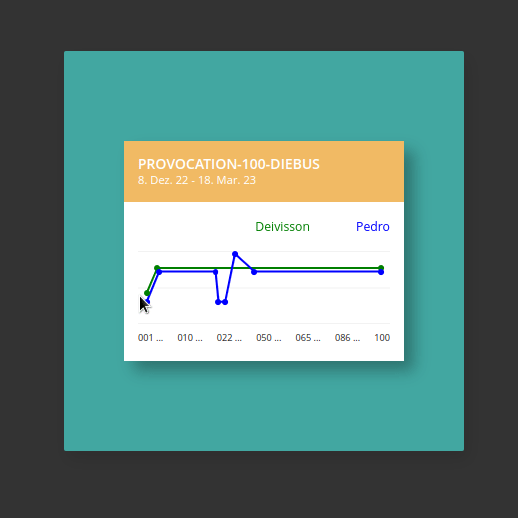

# psychic-graph

Graph with CSS:
[PEDRO](https://github.com/pedrobolfute)
VS
[DEIVISSON](https://github.com/Deivissonxavier)

This graph is a result of a competition against [Deivisson](https://github.com/Deivissonxavier/provocation-100-diebus).

The [Provocation-100-diebus](https://github.com/pedrobolfute/provocation-100-diebus) is a repository that means a hundred days challenge,
and we used it to upload our daily projects.
This chellenge started as a little joy, and the purpose was to maintain the constance.
There was only three rules, that was:

- We cannot copy and paste the code;
- We cannot lose the daily constance, no matter what;
- And we connot upload our daily project after 5AM of another day.

This last one, was a condition for us, if there ware some trouble during the day, then we had the night to do it.

🏆 Well, the winner, for sure was [Deivisson](https://github.com/Deivissonxavier/provocation-100-diebus). Congrats, man! 🏆

He stood constant, no matter what! Sometimes there was no internet, but he could do something about it,
and a lot of events happened just to stop him, but he surpassed his limits.

About me, I had a decay at one time, but I could stand up, and start to fight again, this point was the worst time for me.
Because I had to fight four times more during a period to accomplish him.

By the way, about the graph:

- The green line is a progress;
- The blue line is a progress too.

We had learned a lot of cool things, I found a "[bug](https://github.com/Pedrobolfute/Verdinho)" on git that beneficiates me, and I explored it, then was born the
repository [verdinho](https://github.com/Pedrobolfute/Verdinho).

## 🛠️ Working on this repo yet... Just to no be blank 🛠️

Todo: implementate JS in here.